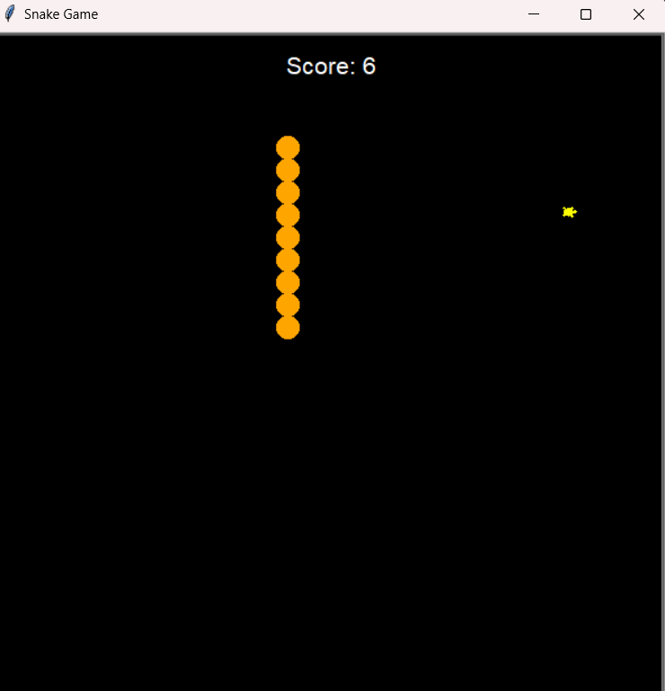

# The Snake Game

A simple snake game written in Python.

## Features

- Classic snake gameplay
- Food that the snake can eat to grow longer
- Game over when the snake hits itself or the edge of the screen

## Controls

- Use the arrow keys to move the snake

## How to Play

1. Start the game by running the `snake.py` file.
2. Use the arrow keys to move the snake around the screen.
3. Eat the food to grow longer.
4. Avoid hitting yourself or the edge of the screen.
5. Get the highest score you can!

## Screenshots

## Credits

This game was created by Gyanendra Tiwari.
